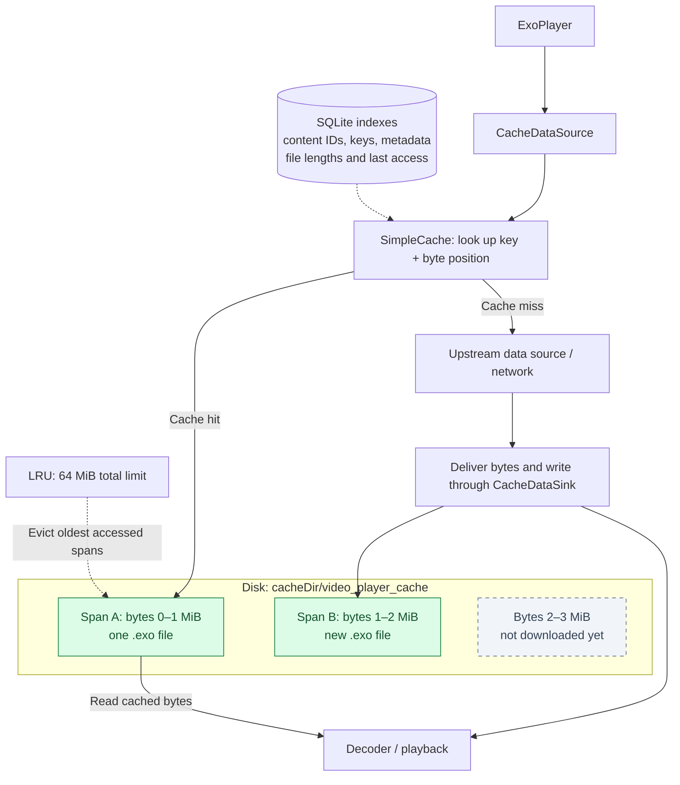

# ExoPlayer: Faster Video Startup with a Disk Cache

Reuse downloaded video bytes with [`VideoPlayerCacheImpl`](VideoPlayerCacheImpl.kt), a small wrapper
around Media3's disk cache. This is useful for repeatedly played clips, such as product videos,
banners, and onboarding animations.

## Demo

[](../../../../../../../../../../docs/media/player_cache_recipe.webm)

[Full recording: player_cache_recipe.webm](../../../../../../../../../../docs/media/player_cache_recipe.webm)
— 75 seconds. The animation above is a short excerpt; the full recording includes repeated launches
and changes to network connectivity.

[`VideoCacheComparisonScreen`](ui/VideoCacheComparisonScreen.kt) plays the same URL in two independent
players: the top one uses the cache; the bottom one does not. The texts and Logcat tags
`VideoWithCache` / `VideoWithoutCache` show **time from setting the source to the first rendered frame**
in milliseconds. This includes preparation and decoding, not just network loading, and differs from
Media3's session `joinTimeMs`.

The first playback fills an empty cache. Recreate the players while keeping the cache to measure a
warm start. Use the same video and repeat measurements under comparable conditions: a single run
does not guarantee that the cached player will start faster.

## Usage

Create the cache once for the application, as in
[`AndroidRecipesApplication`](../../AndroidRecipesApplication.kt):

```kotlin
class AndroidRecipesApplication : Application() {
    val videoPlayerCache by lazy { VideoPlayerCacheImpl(this) }
}
```

Pass that instance to the player builder:

```kotlin
val cache = (context.applicationContext as AndroidRecipesApplication).videoPlayerCache
val player = VideoPlayerBuilder(context)
    .setCache(cache)
    .setPlayWhenReady(true)
    .build()

player.setSource(VideoPlayerSource.Url(videoUrl))
player.prepare()

// When this player is no longer needed:
player.release()
```

The default limit is **64 MiB**, stored in `cacheDir/video_player_cache`. Pass a
[`VideoPlayerCacheConfig`](../core/cache/VideoPlayerCacheConfig.kt) to customize it.
`clear()` removes cached resources; `snapshot()` reports usage. Reuse the same cache instance for all
players using that directory. Releasing a player leaves the shared cache available.

## What is inside?

- **`SimpleCache`** stores downloaded byte ranges as `.exo` files on disk, separately from the
  player's in-memory playback buffer.
- **`LeastRecentlyUsedCacheEvictor`** applies LRU eviction when the size limit is reached. It removes
  the least recently used **spans**, not necessarily entire videos. This is not Android's `LruCache`.
- **`StandaloneDatabaseProvider`** supplies SQLite indexes. They map numeric content IDs to cache
  keys and metadata, and record file lengths and last-access timestamps. SQLite helps Media3 locate
  spans after a restart; it does not store or decode the video bytes.
- **`CacheDataSource`** reads cached ranges and fetches missing ones from upstream.
  **`CacheDataSink`** writes incoming bytes into cache files while playback proceeds.

### How spans are stored

A span is a contiguous byte range for one cache key. Several files can belong to the same video,
with gaps for ranges that have not been downloaded. Sizes below are illustrative: spans are not
fixed-duration video segments or necessarily equal-sized blocks.



The diagram omits internal subdirectories. Media3 identifies spans by their cache key, byte position,
and length; the file name and SQLite indexes provide the information needed to reconstruct the cache.

## Use the cache where reuse is likely

Choose videos that are replayed and **do not change frequently on the backend**. If the feed constantly
introduces new clips and exceeds the cache limit, LRU keeps evicting old spans and writing new ones.
With little reuse, the improvement can be negligible while downloads and disk writes continue.

By default, this recipe uses the URI as the cache key. If the bytes behind the same URL change,
previously cached data can become stale: use a versioned URL or explicitly invalidate the old resource.
Frequently changing URLs, including query parameters, also reduce cache reuse. LRU manages space;
it does not validate content freshness.

## References

- [Media3: caching media](https://developer.android.com/media/media3/exoplayer/network-stacks#caching-media)
- [SimpleCache](https://developer.android.com/reference/androidx/media3/datasource/cache/SimpleCache)
- [CacheSpan](https://developer.android.com/reference/androidx/media3/datasource/cache/CacheSpan)
- [LeastRecentlyUsedCacheEvictor](https://developer.android.com/reference/androidx/media3/datasource/cache/LeastRecentlyUsedCacheEvictor)
