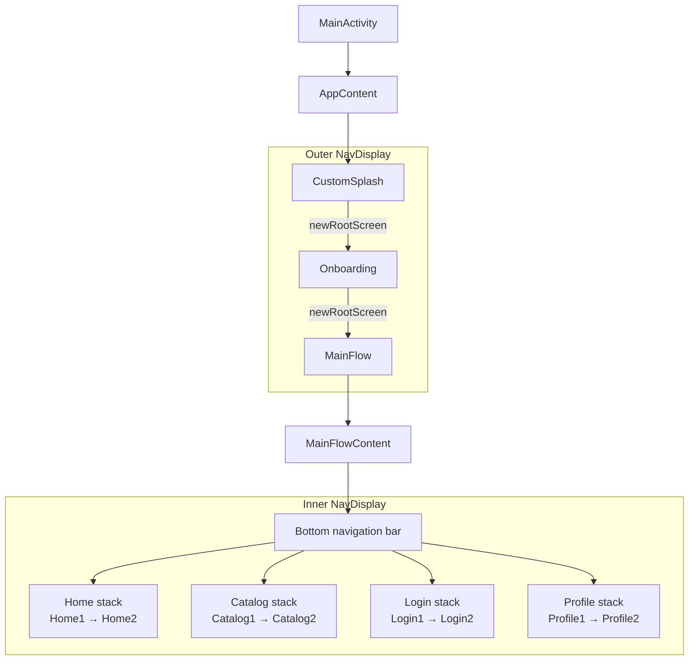
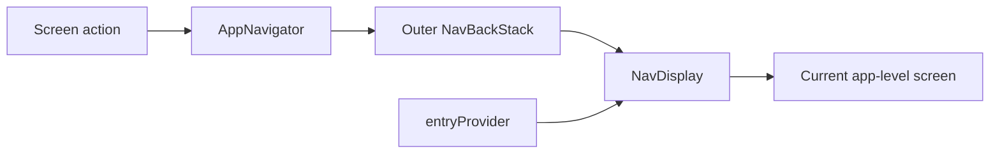
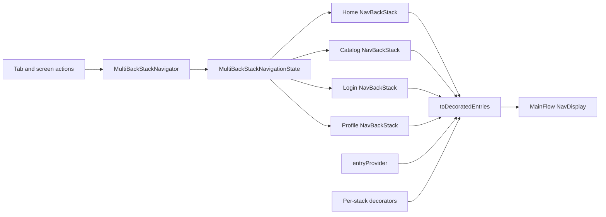
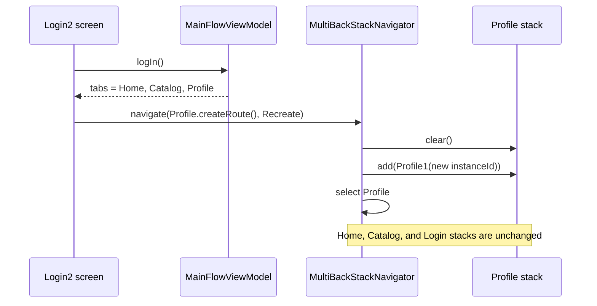

# Navigation 3: Nested Flows and Multiple Back Stacks

This recipe demonstrates a Navigation 3 setup for an application that has two navigation levels:

1. An application-level flow for splash, onboarding, and the main application.
2. A main flow with a bottom navigation bar and an independent back stack for every tab.

It also demonstrates how to replace Login with Profile after authentication, restore Login after
logout, and recreate only the newly visible tab without resetting unrelated tabs.

The diagrams below adapt the data-flow model from the
[Navigation 3 documentation](https://developer.android.com/guide/navigation/navigation-3/basics)
to the two navigation levels used by this recipe.

## Navigation structure



`AppContent` and `MainFlowContent` intentionally own different navigation state. The outer flow
decides which major part of the application is running. The inner flow manages navigation inside
the main application and preserves each tab independently.

## Routes and keys

Navigation 3 treats the back stack as application-owned state. Every item in a back stack is a key
that can be resolved to UI content.

- [`Route`](Route.kt) is the common marker for every destination and extends `NavKey`.
- [`TopLevelRoute`](TopLevelRoute.kt) marks the root of an independent tab back stack.
- [`AppDestination`](ui/AppDestination.kt) defines `CustomSplash`, `Onboarding`, and `MainFlow`.
- [`MainFlowDestination`](ui/MainFlowDestination.kt) defines the root and nested destination for
  each main-flow tab.

All route implementations are serializable so `rememberNavBackStack` can restore them after a
configuration change or process recreation.

Top-level routes are data classes with an `instanceId`:

```kotlin
@Serializable
data class Profile1(
    val instanceId: String = newInstanceId(),
) : MainFlowDestination, TopLevelRoute
```

The top-level route class identifies the stack, while `instanceId` identifies a particular root
entry. A fresh ID lets the recipe replace a root with a new key when that stack must be recreated.

## The outer application flow

[`AppContent`](ui/AppContent.kt) creates one back stack starting at `CustomSplash` and displays it
with an outer `NavDisplay`.



[`AppNavigator`](app_navigator/AppNavigator.kt) owns the mutations applied to this stack:

- `navigate` adds a destination.
- `replace` replaces the last destination.
- `newRootScreen` clears the stack and adds a new root.
- `goBack` removes the last destination only when another destination remains.

Splash and onboarding use `newRootScreen`. After onboarding opens `MainFlow`, pressing Back cannot
return to onboarding or splash.

The outer `NavDisplay` installs these decorators:

- `rememberSaveableStateHolderNavEntryDecorator` retains saveable Compose state for entries.
- `rememberAppNavigatorNavEntryDecorator` exposes `AppNavigator` through `LocalAppNavigator`.
- `rememberViewModelStoreNavEntryDecorator` scopes ViewModels to navigation entries.

## The main flow

[`MainFlowViewModel`](ui/MainFlowViewModel.kt) provides two tab collections:

- `allTabs` always contains Home, Catalog, Login, and Profile. It is used to create and retain every
  possible back stack.
- `tabs` contains only the tabs currently shown in the bottom bar. Logged-out users see Login;
  logged-in users see Profile.

Keeping `allTabs` stable is important. Authentication changes the visible navigation UI without
removing a registered stack from `MultiBackStackNavigationState`.

[`rememberMultiBackStackNavigationState`](multi_back_stack/MultiBackStackNavigationState.kt)
creates one `NavBackStack` for each concrete `TopLevelRoute` class. It also saves the selected
top-level route and restores it with the stacks.



Only the start stack and the selected stack are passed to `NavDisplay`. The other stacks remain in
memory and keep their navigation and destination state. This implements the "exit through Home"
behavior:

- Back removes the current nested destination when the selected stack has more than one entry.
- Back from another tab's root selects Home.
- Back from the Home root leaves navigation state unchanged, allowing the system to handle exiting
  the application.

Each stack receives separate saveable-state and ViewModel decorators. Reusing a single decorator
instance across all stacks would mix their destination scopes.

## Navigating inside and between stacks

`MultiBackStackNavigator` is provided to every main-flow entry through
`LocalMultiBackStackNavigator`.

- Calling `navigate(Home2)` adds `Home2` to the currently selected stack.
- Calling `navigate(Catalog1())` selects the Catalog stack.
- Calling `navigate(route, topLevelRoute)` selects a particular stack and adds a nested route to
  it in one operation.
- Calling `replace(route)` replaces the current nested route but never removes a top-level root.

The bottom navigation bar compares route classes to determine selection. Selecting a different tab
uses `Preserve`; selecting the current tab uses `PopToRoot`.

## Back-stack policies

[`BackStackPolicy`](multi_back_stack/MultiBackStackNavigator.kt) controls what happens to a
top-level stack when it is selected.

| Policy | Behavior | Typical use |
| --- | --- | --- |
| `Preserve` | Selects the stack without changing its entries. | Switching between tabs. |
| `PopToRoot` | Removes nested entries but keeps the existing root and its state. | Tapping the selected tab again. |
| `Recreate` | Clears the stack and adds the supplied top-level route as a new root. | Rebuilding Login or Profile after authentication changes. |

`Recreate` differs from `PopToRoot` because the root itself is replaced. `AppTabBarItem.createRoute()`
creates a top-level route with a new `instanceId`, ensuring that the recreated root receives a new
navigation key and a fresh destination scope.

## Authentication and targeted recreation

The recipe uses a simple `isUserLoggedIn` value in `MainFlowViewModel`. Login and logout update that
value, which changes the visible tab list. Both Login and Profile stacks stay registered, so the
newly visible stack can be selected and recreated immediately.



Logout performs the inverse operation: `Profile2` calls `logOut()`, then navigates to a freshly
created `Login1` with `Recreate`. Only the Login stack is cleared and selected. Home, Catalog, and
Profile remain untouched.

This targeted approach is useful when authentication changes the meaning or dependencies of one
tab. It avoids discarding unrelated user navigation, such as an open Catalog detail screen.

## Files in this recipe

- [`ui/AppContent.kt`](ui/AppContent.kt): outer application flow.
- [`ui/MainFlowContent.kt`](ui/MainFlowContent.kt): tab bar, inner `NavDisplay`, and entry provider.
- [`ui/AppTabBarItem.kt`](ui/AppTabBarItem.kt): tab definitions and fresh root creation.
- [`app_navigator`](app_navigator): single-stack navigator and its entry decorator.
- [`multi_back_stack`](multi_back_stack): multi-stack state, navigator, CompositionLocal, and entry
  decorator.

## Further reading

- [Navigation 3 overview](https://developer.android.com/guide/navigation/navigation-3)
- [Navigation 3 basics](https://developer.android.com/guide/navigation/navigation-3/basics)
- [Official multiple back stacks recipe](https://github.com/android/nav3-recipes/tree/main/app/src/main/java/com/example/nav3recipes/multiplestacks)
- [Official conditional navigation recipe](https://github.com/android/nav3-recipes/tree/main/app/src/main/java/com/example/nav3recipes/conditional)
